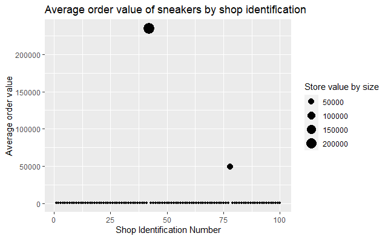
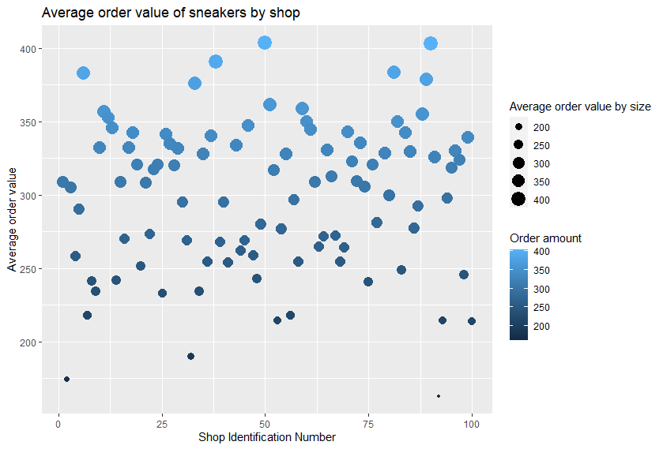

## Question 1

Given some sample data, write a program to answer the following: click
here to access the required data set

On Shopify, we have exactly 100 sneaker shops, and each of these shops
sells only one model of shoe. We want to do some analysis of the average
order value (AOV). When we look at orders data over a 30 day window, we
naively calculate an AOV of \$3145.13. Given that we know these shops
are selling sneakers, a relatively affordable item, something seems
wrong with our analysis.

a.  Think about what could be going wrong with our calculation. Think
    about a better way to evaluate this data.
b.  What metric would you report for this dataset?
c.  What is its value?

------------------------------------------------------------------------

### Attaching packages

```{r, message = FALSE, warning = FALSE}
library(here)
library(tidyverse)
```

```{r}
# Read in .csv file
shopify_data <- read_csv(here("2019 Winter Data Science Intern Challenge Data Set - Sheet1.csv"))

```

```{r results='hide'}
# Assess the data
shopify_data$order_amount # Review the order_amount column

checkNA <- is.na(shopify_data) # Check for any NA values in the dataset

shopifyaveragevalue <- mean(shopify_data$order_amount) # This is the original way Shopify used to calculate the AOV

sort(shopify_data$order_amount, decreasing = T) # Dataset has large values upon reviewing the entire order_amount column
```

## Initial thoughts

Average is done on the entire order_amount column but that doesnt take
into account the actual order amounts per shop as some shops may sell a
higher cost sneaker than others.

------------------------------------------------------------------------

```{r}
# Clean up
sneakers <- shopify_data %>%
  group_by(shop_id) %>%
  mutate(shop_count = n()) %>% # Counts the number of times a user_id has bought items at that shop_id
  summarise(AverageStoreValue = mean(rep(order_amount)))%>% # Find the mean for each store
  group_by(AverageStoreValue) %>% 
  arrange(desc(AverageStoreValue)) # Sort by decreasing 
```

```{r}
# Visualize the data
ggplot(data = sneakers, mapping = aes(x = shop_id, AverageStoreValue, size = AverageStoreValue)) + 
  geom_point() + 
  labs(title = "Average order value of sneakers by shop identification", 
       x = "Shop Identification Number", 
       y = "Average order value", 
       size = "Store value by size") +
  guides(colour = FALSE)
```

```{r}
# Check and remove outliers
sneaker_outliers <- sneakers %>%
  mutate(AverageStoreValue = sort(AverageStoreValue, decreasing = T)) %>% # You can see there are 2 outliers when we look at the ascending to descending values of the average store 
  filter(!AverageStoreValue > 1000) # Filter stores out that have an AverageStoreValue greater than 1000
```

```{r}
# Visualize the data without outliers
ggplot(data = sneaker_outliers, mapping = aes(x = shop_id, AverageStoreValue, color = AverageStoreValue, size = AverageStoreValue)) + 
  geom_point() + 
  labs(title = "Average order value of sneakers by shop", 
       x = "Shop Identification Number", 
       y = "Average order value", 
       size = "Average order value by size",
       color = "Order amount")
```


### 1a. Think about what could be going wrong with our calculation. Think about a better way to evaluate this data.

With the calculation, a better way to calculate the average order value
(AOV) is to take the average of each store rather than the average of
the entire order_amount. The data becomes more skewed when we take an
average without thinking of other factors. For this specific dataset,
understanding that although sneakers are a relatively affordable item,
that doesn't necessarily mean all shops will sell them at affordable
prices.

By taking the AOV per store, it is easier to grasp which stores may or
may not have higher relative averages that will skew the data. On this
dataset, after cleaning and analyzing the data, shop_id 42 and 78 have
higher averages than the other 98 shops in the dataset.

------------------------------------------------------------------------

### 1b. What metric would you report for this dataset?

After reviewing Question 1a., the AOV per store makes it easier to
visualize and then by removing the outliers from shop_id 42 and 78, you
can see the data for the other shops average order value are in a
similar range. Although the way Shopify calculates the AOV 'works', it
doesnt take into account each store which may have a different amount of
sales or the pricing per sneakers.

------------------------------------------------------------------------

```{r}
sneakers_median <- median(shopify_data$order_amount)
```

### 1c. What is its value?

The median value is \$284 on the order_amount column!

------------------------------------------------------------------------

## Question 2

For this question you'll need to use SQL. Follow this link to access the
data set required for the challenge. Please use queries to answer the
following questions. Paste your queries along with your final numerical
answers below.

a.  How many orders were shipped by Speedy Express in total?
b.  What is the last name of the employee with the most orders?
c.  What product was ordered the most by customers in Germany?

## a. How many orders were shipped by Speedy Express in total?
```{sql}
SELECT * FROM Orders
WHERE ShipperID='1'
```
## b. What is the last name of the employee with the most orders?
```{sql}
SELECT e.LastName, COUNT(o.OrderID) as NumberofOrders
FROM Employees as e
JOIN Orders as o
ON e.EmployeeID = o.EmployeeID
GROUP BY e.EmployeeID
ORDER BY NumberofOrders 
DESC
LIMIT 1
```

## c. What product was ordered the most by customers in Germany?
```{sql}
SELECT p.ProductName, SUM(Quantity) AS TotalQuantity
From Orders AS o, OrderDetails AS od, Products AS p, Customers as c
WHERE od.OrderID = o.OrderID 
AND od.ProductID = p.ProductID 
AND c.CustomerID = o.CustomerID 
AND c.Country = "Germany" 
GROUP BY p.ProductID ORDER BY TotalQuantity DESC
LIMIT 1
```
