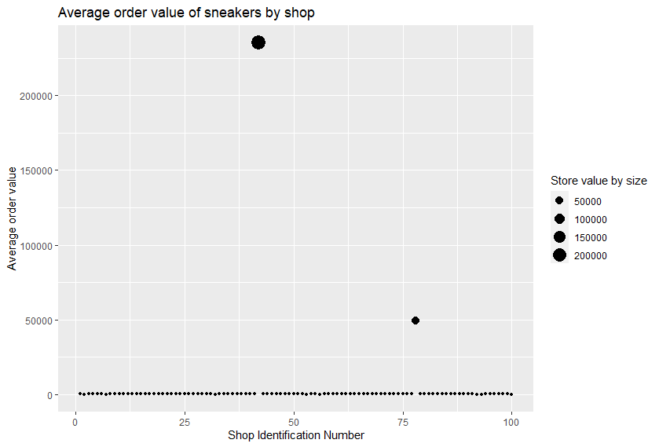
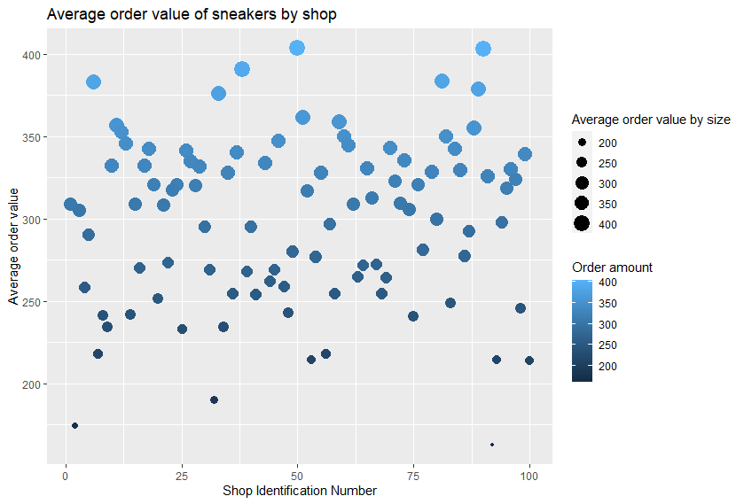

## Question 1

### Attaching packages and inspecting the dataset

```{r, message = FALSE, warning = FALSE}
library(here)
library(tidyverse)

# Read in .csv file
shopify_data <- read_csv(here("2019 Winter Data Science Intern Challenge Data Set - Sheet1.csv"))

# Assess the data
shopify_data$order_amount # Review the order_amount column
checkNA <- is.na(shopify_data) # Check for any NA values in the dataset
shopifyaveragevalue <- mean(shopify_data$order_amount) # This is the original way Shopify used to calculate the AOV
sort(shopify_data$order_amount, decreasing = T) # Dataset has large values upon reviewing the entire order_amount column
```

### Initial thoughts

The Average is done on the order_amount column but that doesnt take
into account the actual order amounts per shop as some shops may sell a
higher cost sneaker than others. When exploring the dataset, checking if there are any NA values is crucial! 
This is incase NA values are causing trouble in our calculations.  Since there are no NA values, the next step
is to see why the Shopify average order value (AOV) is so high. Woah! When we sort by ascending, you can see 
that 2 rows of data in the order_amount column have a high AOV! 

------------------------------------------------------------------------

### Clean up and visualize data

```{r}
# Clean up
sneakers <- shopify_data %>%
  group_by(shop_id) %>%
  mutate(shop_count = n()) %>% # Counts the number of times a user_id has bought items at that shop_id
  summarise(AverageStoreValue = mean(rep(order_amount)))%>% # Find the mean for each store
  group_by(AverageStoreValue) %>% 
  arrange(desc(AverageStoreValue)) # Sort by decreasing 
  
  # Visualize the data
ggplot(data = sneakers, mapping = aes(x = shop_id, AverageStoreValue, size = AverageStoreValue)) + 
  geom_point() + 
  labs(title = "Average order value of sneakers by shop identification", 
       x = "Shop Identification Number", 
       y = "Average order value", 
       size = "Store value by size") +
  guides(colour = FALSE)
```


### Mid-point thoughts

When you visualize the data, the graph doesnt look amazing! This is because there is a large outlier
that is skewing the data. We are unable to view shops that have a smaller AOV due to this point.
This is interesting! Some thoughts that come to mind are "Why do these 2 shops have such high averages?"

On further inspection and exploration of the data, the 2 shops that have high AOV's are 42 and 78. There is no
information on the shop and the pricing of the sneakers or if they sell high-end luxury sneakers. However, we can make
the assumption that these two stores sell higher than average sneakers. This is the root cause of our skewed data. 

### Remove outliers and re-visualize data

```{r}
# Check and remove outliers
sneaker_outliers <- sneakers %>%
  mutate(AverageStoreValue = sort(AverageStoreValue, decreasing = T)) %>% # You can see there are 2 outliers when we look at the ascending to descending values of the average store 
  filter(!AverageStoreValue > 1000) # Filter stores out that have an AverageStoreValue greater than 1000
  
# Visualize the data without outliers
ggplot(data = sneaker_outliers, mapping = aes(x = shop_id, AverageStoreValue, color = AverageStoreValue, size = AverageStoreValue)) + 
  geom_point() + 
  labs(title = "Average order value of sneakers by shop", 
       x = "Shop Identification Number", 
       y = "Average order value", 
       size = "Average order value by size",
       color = "Order amount")
```


### Final thoughts

Wow! After removing the outliers, you can clearly see that the AOV of shop 42 and 78 skewed the data enormously. 
With the size dot variation and variable colours you can see which shops have large AOV's visually. This helps viewers
glance easily at a graph and be able to understand quickly what it is portraying. 

It is important to note, the outliers are removed. It may be more beneficial to set price point brackets on the type of sneakers from affordable to luxury. 
That way, Shopify can do a better analysis on the goods sold by sellers and in turn can produce meaningful statistics from the revenue.

### 1a. Think about what could be going wrong with our calculation. Think about a better way to evaluate this data.

With the calculation, a better way to calculate the AOV is to take the 
average of each store rather than the average of
the entire order_amount. The data becomes more skewed when we take an
average without thinking of other factors. For this specific dataset,
understanding that although sneakers are a relatively affordable item,
that doesn't necessarily mean all shops will sell them at affordable
prices.

By taking the AOV per store, it is easier to grasp which stores may or
may not have higher relative averages that will skew the data. On this
dataset, after cleaning and analyzing the data, shop_id 42 and 78 have
higher averages than the other 98 shops in the dataset.

------------------------------------------------------------------------

### 1b. What metric would you report for this dataset?

After reviewing Question 1a., the AOV per store makes it easier to
visualize and then by removing the outliers from shop_id 42 and 78, you
can see the data for the other shops average order value are in a
similar range. Although the way Shopify calculates the AOV 'works', it
doesnt take into account each store which may have a different amount of
sales or the pricing per sneakers. A better metric to report this dataset
is using the median. The median can be more descriptive in a dataset than
calculating the average. This is because the median is less affected by
outliers in a dataset which can give an approximate mean. 

------------------------------------------------------------------------

### 1c. What is its value?

The median value is $284 on the order_amount column! This is a better
number than the initial AOV calculated by Shopify! The median accounted 
for shop_id 42 and 78's high order amount and produced an approximate
average.

```{r}
sneakers_median <- median(shopify_data$order_amount)
```
------------------------------------------------------------------------

## Question 2

For this question you'll need to use SQL. Follow this link to access the
data set required for the challenge. Please use queries to answer the
following questions. Paste your queries along with your final numerical
answers below.

a.  How many orders were shipped by Speedy Express in total?
b.  What is the last name of the employee with the most orders?
c.  What product was ordered the most by customers in Germany?

### a. How many orders were shipped by Speedy Express in total?

A total of 54 orders were shipped by Speedy Express. 

```{sql}
SELECT * FROM Orders
WHERE ShipperID='1'
```
### b. What is the last name of the employee with the most orders?

The last name of the employee with the most orders is Peacock.

```{sql}
SELECT e.LastName, COUNT(o.OrderID) as NumberofOrders
FROM Employees as e
JOIN Orders as o
ON e.EmployeeID = o.EmployeeID
GROUP BY e.EmployeeID
ORDER BY NumberofOrders 
DESC
LIMIT 1
```

### c. What product was ordered the most by customers in Germany?

The product that was ordered the most by customers in Germany is
Boston Crab Meat. 

```{sql}
SELECT p.ProductName, SUM(Quantity) AS TotalQuantity
From Orders AS o, OrderDetails AS od, Products AS p, Customers as c
WHERE od.OrderID = o.OrderID 
AND od.ProductID = p.ProductID 
AND c.CustomerID = o.CustomerID 
AND c.Country = "Germany" 
GROUP BY p.ProductID ORDER BY TotalQuantity DESC
LIMIT 1
```
